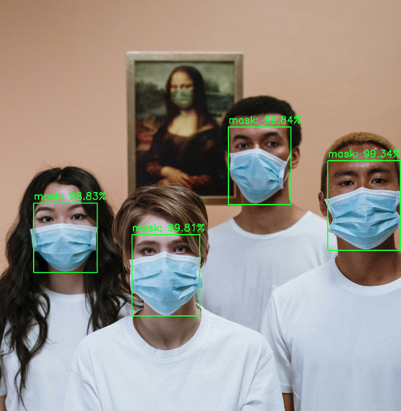

# nvir-mask-demo
This is a demo repo to demonstrate [nilvana vision inference runtime](https://nilvana.tw/products/nilvana-vision-inference-runtime).

## Get Started ##

```python
python3 -m venv .venv
source .venv/bin/activate
pip3 install -r requirements.txt

python3 simple.py   # image request
python3 simple2.py  # with display
python3 video.py    # video
```

## Demo 

|  |
|:--:|
| <b>Image with bounding boxes</b>|

|  |
|:--:|
| <b>Video with bounding boxes</b>|


## Assets

- Video by cottonbro from Pexels: https://www.pexels.com/video/woman-art-iphone-smartphone-3960181/

- Photo by cottonbro from Pexels: https://www.pexels.com/photo/people-wearing-face-mask-for-protection-3957986/